# Eclipse setup

Make sure you have run build FIRST. 

Download This specific version of Eclipse 

https://github.com/CommonWealthRobotics/ExternalEditorsBowlerStudio/releases

## Setup Eclipse

**Import The Source**

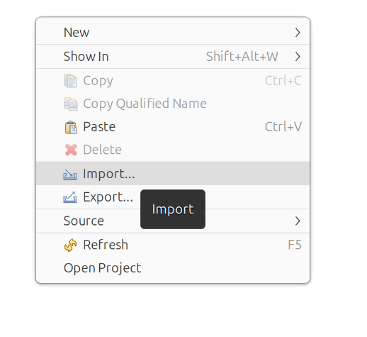

**Select gradel ane press next**

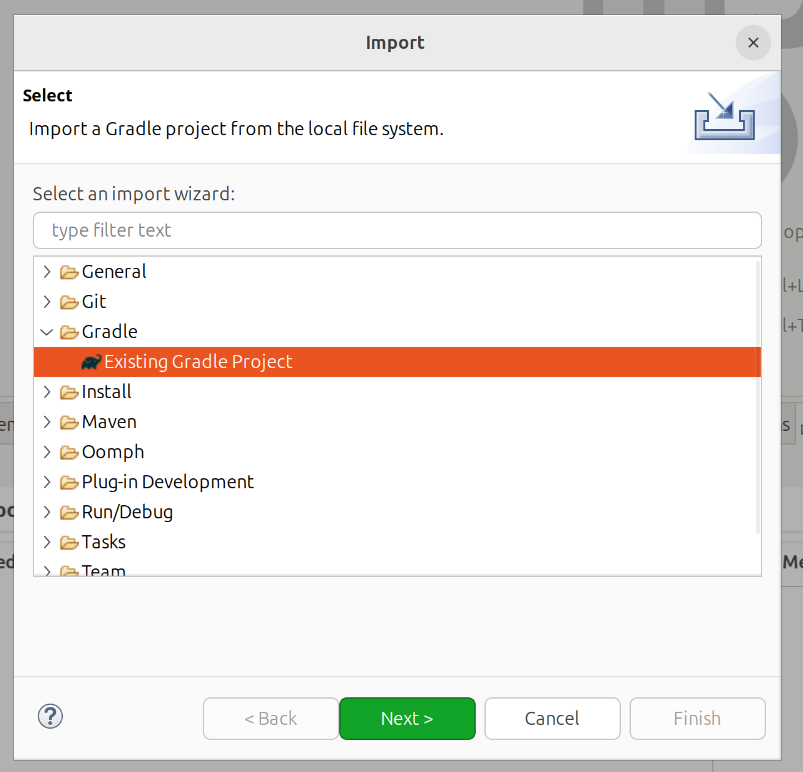

**Enter where you downloaded the sources in the build step and press next **

**DO NOT press finish **

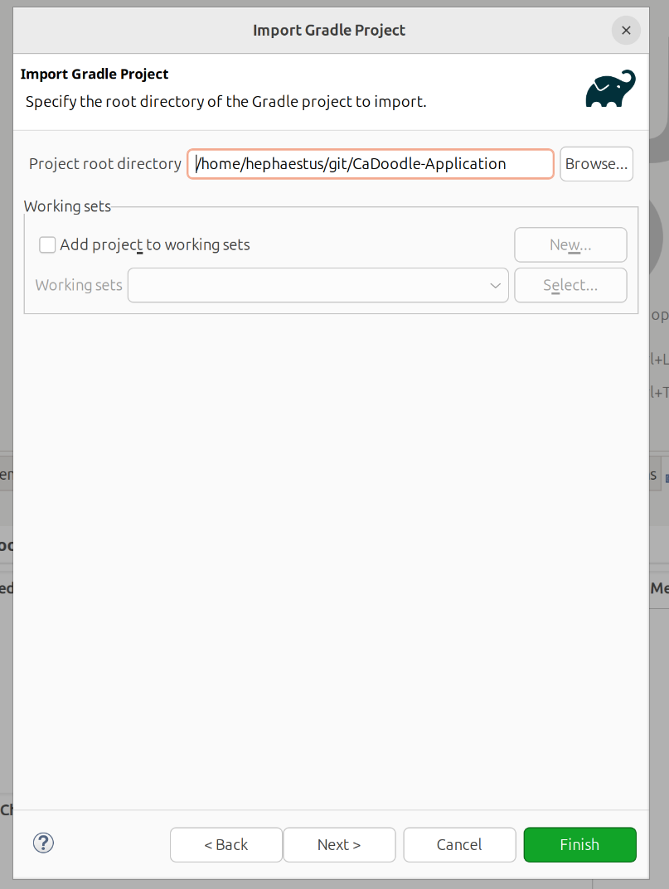

**Use custom configuration and set the Java Home to where the build script put the JVM**

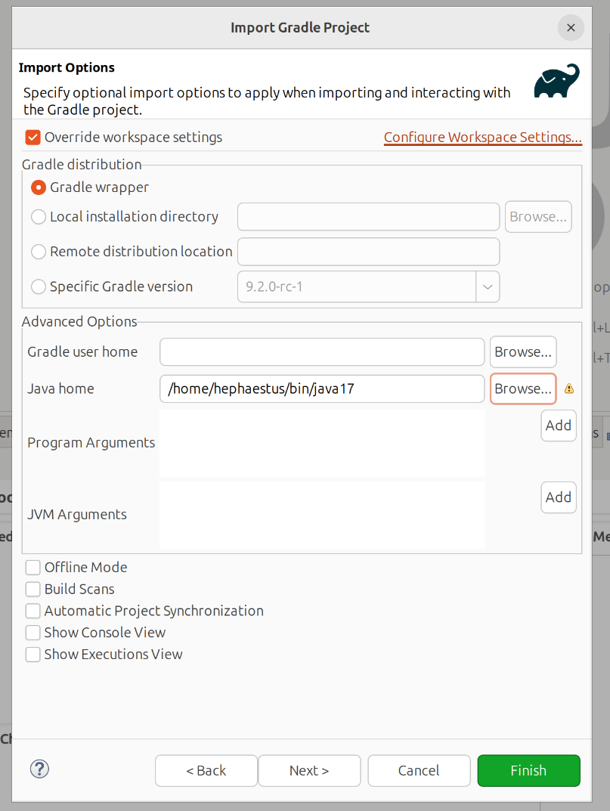

**Now hit finish**

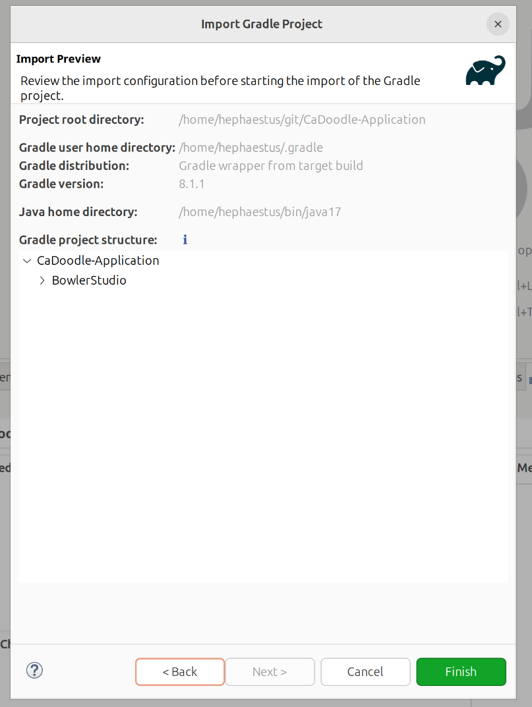

## Once and only once per workspace, configure Eclipse

**If you import and the build has build errors like this, you may have not yet configured eclipse**

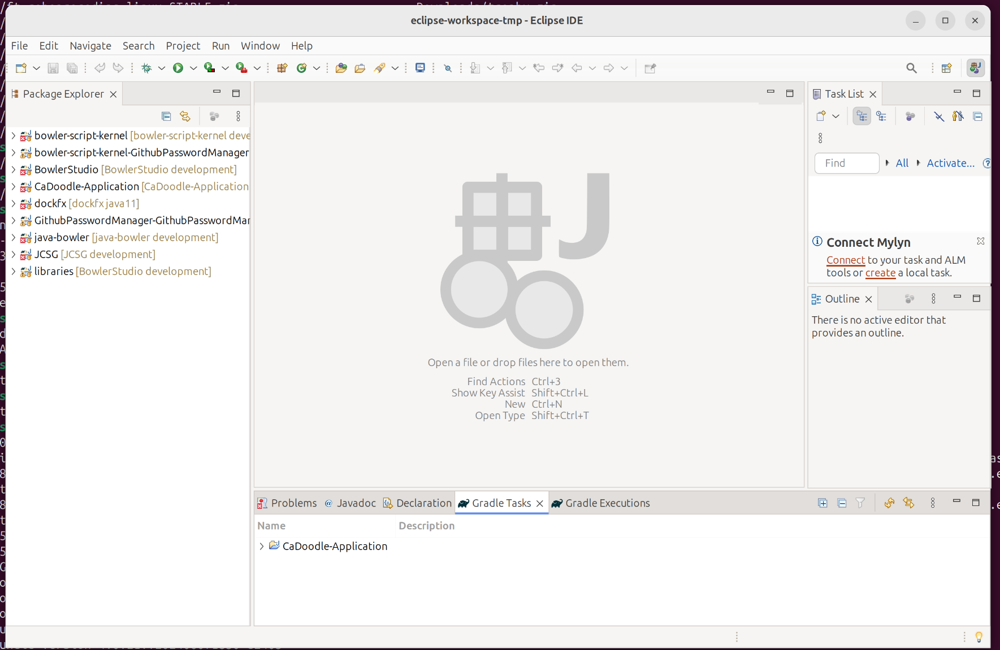

**Go to Window->Preferences**

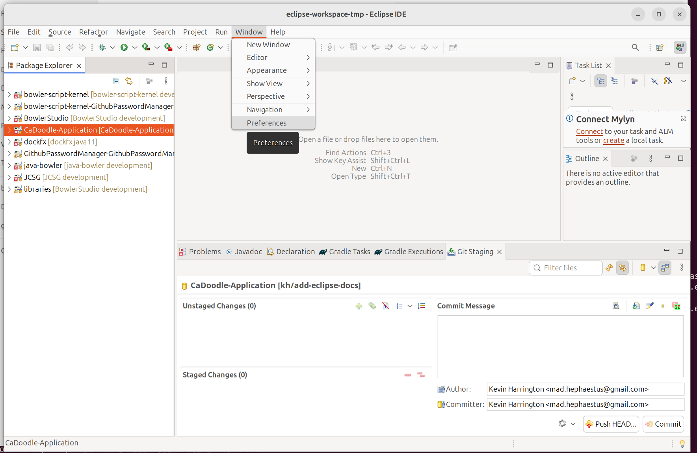

**Go to the Java->Installed JREs**

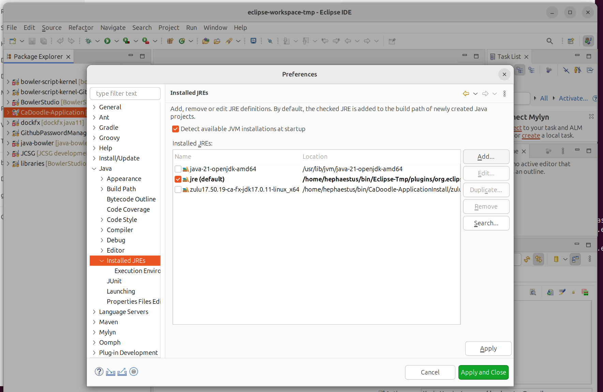

**Click Add... and select Standard VM and press next**

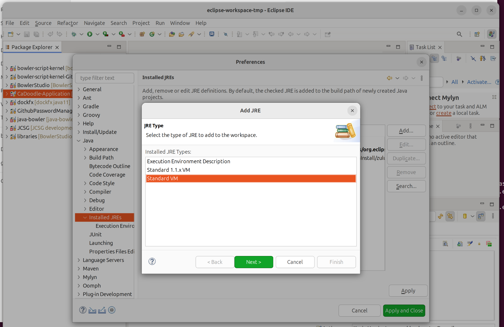

**Enter the directory where the build script extracted the JVM and hit finish.**

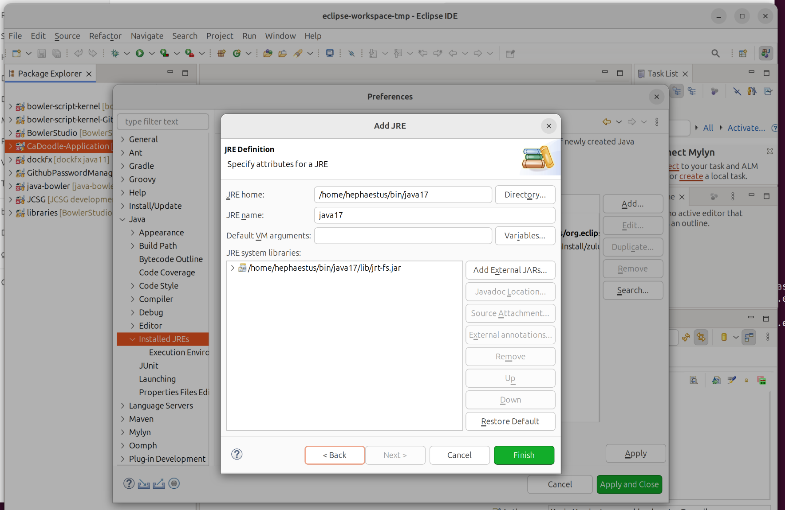

**Set the JVM you added as default and delete any others**

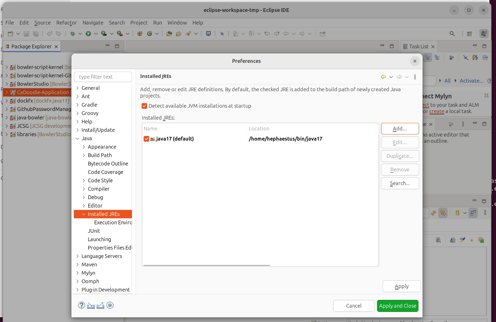

**Go to Java->Compiler->Errors/Warnings->Deprecated and Restricted and set Forbidden Reference to ignore**

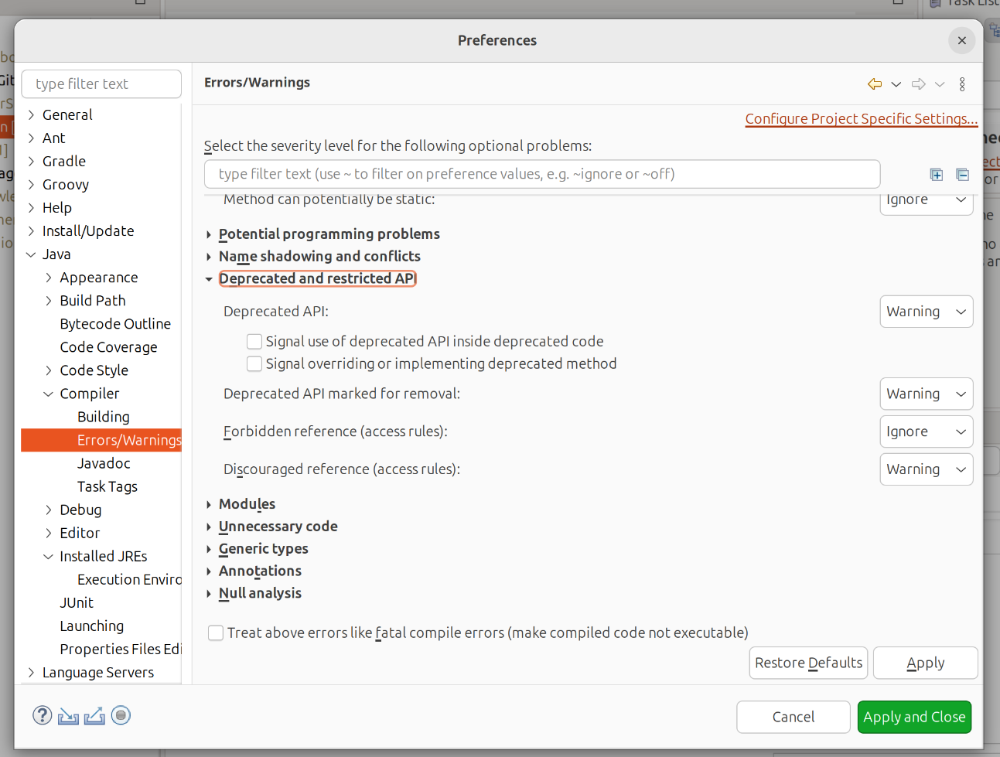

**got to Java->Compiler->Building->Build Path Problems and set incompatable required binaries to Ignore**

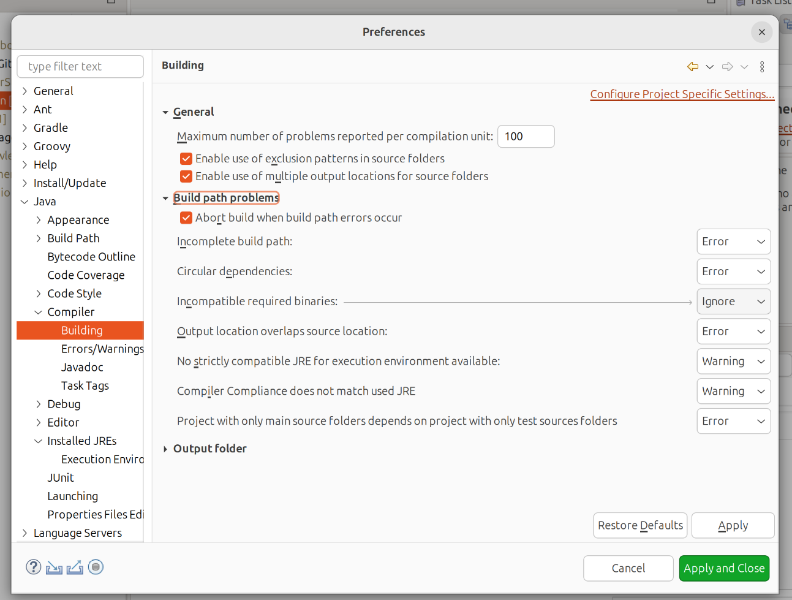

**Go to Java->Compiler and set Compiler compliance level to 1.8**

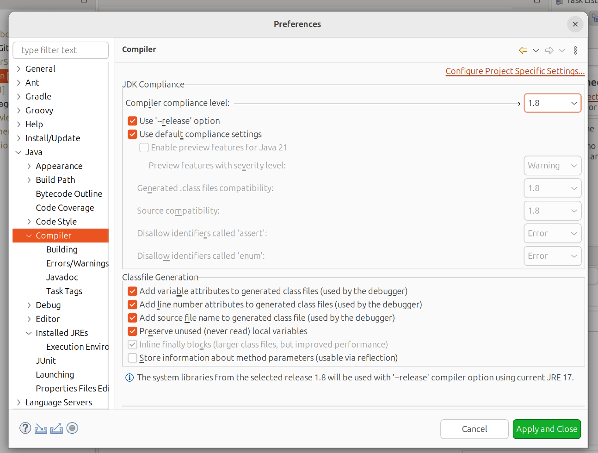