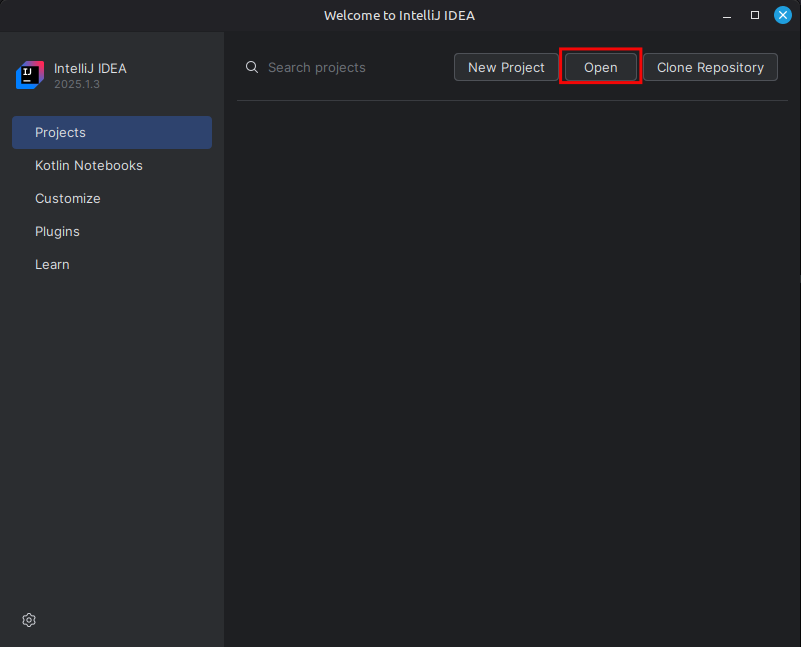
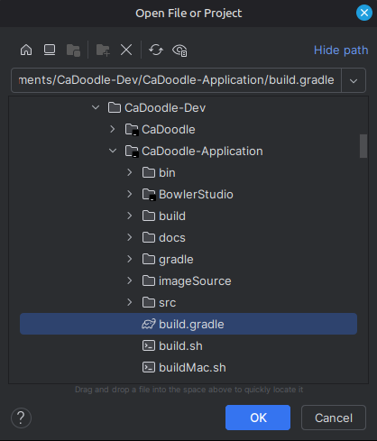
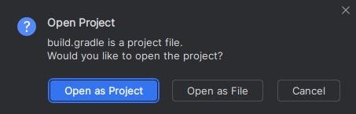
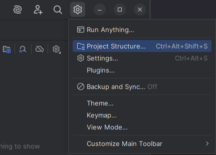
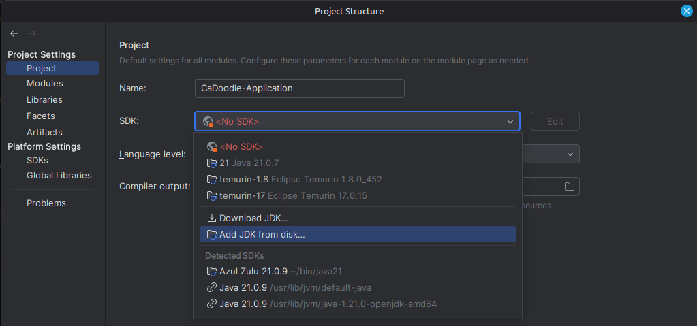
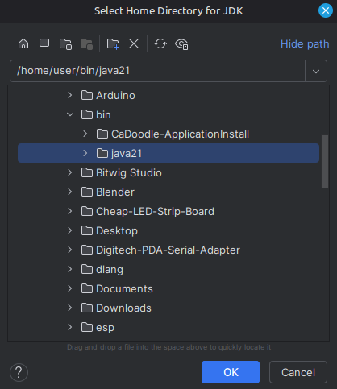
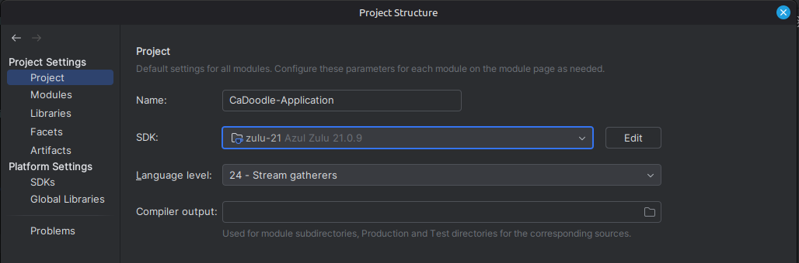
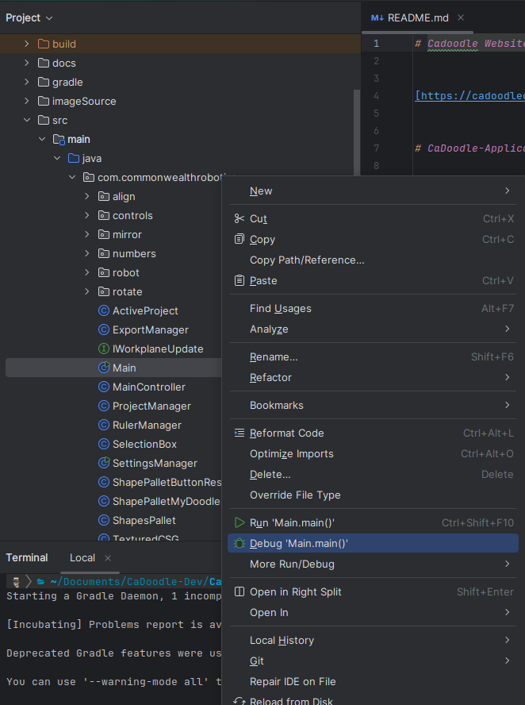
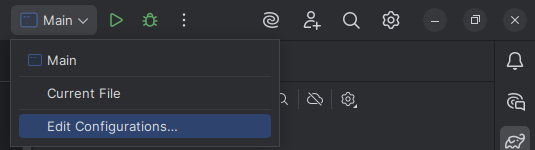
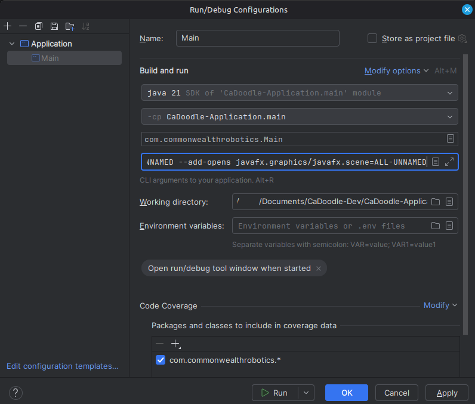

## Importing the project
If you haven't already, go back to the README [and do the instructions for your platform](https://github.com/CommonWealthRobotics/CaDoodle-Application?tab=readme-ov-file#build-linux) 
#### **If you are using IDEA for the first time, do not select a JDK when asked**

1. On the Welcome Screen, import the CaDoodle-Application project using the `build.gradle` file. Open it as a project
		
	- Note: Don't try to import the BowlerStudio folder
	  
	  

## Setting the Zulu JDK
We're going to setup IDEA to use the Zulu JDK the build script added to our `/home/user/bin` folder/the JDK Windows folks extracted

1. Click the cog on the top left, open the project structure
	
2. In `Project > SDK`, click on the `SDK` drop down. Click `Add JDK from disk...`
   
3. Navigate over to your JDK's location
	- Note for Windows people, we're using the JDK that you extracted earlier
	  
4. Click OK
5. Now you'll have a SDK defined named `zulu-<JDK Version> Azul Zulu <Java Version>`
   
6. Click OK

## Setting up the Run/Debug config
1. To quickly setup a Run/Debug config, tunnel in the Project files to the Main class. Right click it and select `Debug 'Main.main()'`
   
2. Let it start, then close CaDoodle
3. Now we'll add the arguments we want debug to launch CaDoodle with. Up top, click `Main` and then `Edit Configurations...`
   
4. In `Program arguments` we will add this:
	
	```-Dprism.forceGPU=true -XX:MaxRAMPercentage=90.0 --add-exports javafx.graphics/com.sun.javafx.css=ALL-UNNAMED --add-exports javafx.controls/com.sun.javafx.scene.control.behavior=ALL-UNNAMED --add-exports javafx.controls/com.sun.javafx.scene.control=ALL-UNNAMED --add-exports javafx.base/com.sun.javafx.event=ALL-UNNAMED --add-exports javafx.controls/com.sun.javafx.scene.control.skin.resources=ALL-UNNAMED --add-exports javafx.graphics/com.sun.javafx.util=ALL-UNNAMED --add-exports javafx.graphics/com.sun.javafx.scene.input=ALL-UNNAMED --add-opens javafx.graphics/javafx.scene=ALL-UNNAMED```

	- What `Program arguments` looks like after
	  
5. Hit OK. You will now notice a significant decrease in warnings in the Debug panel
