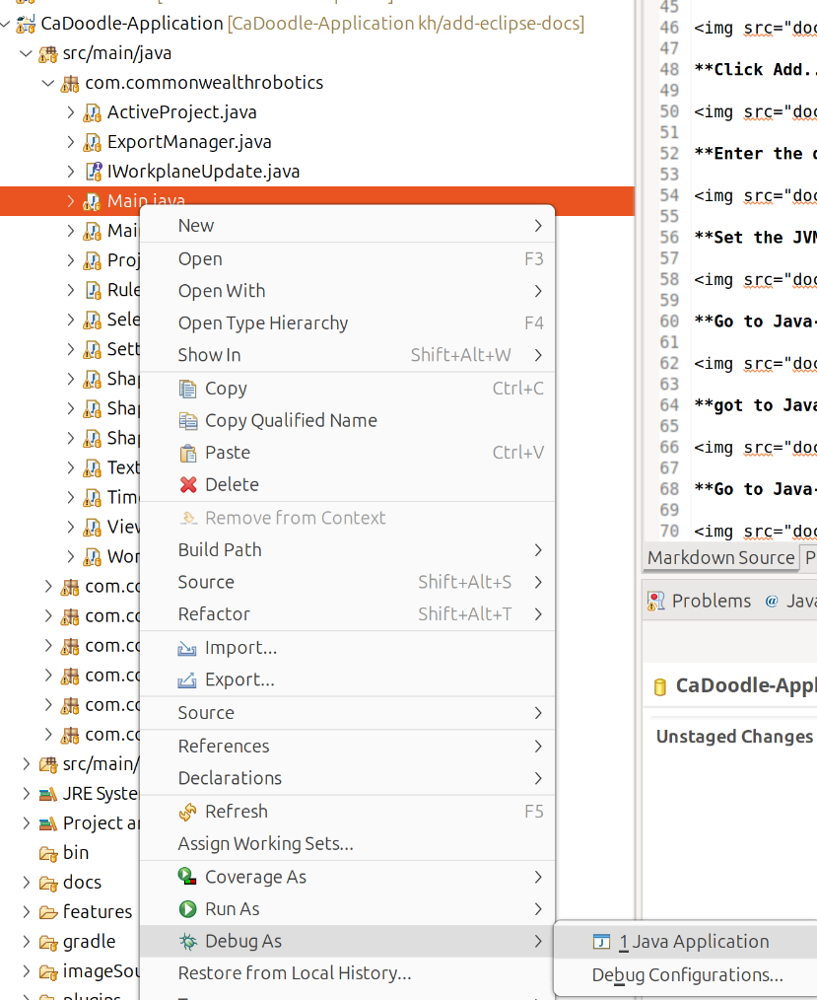

# Cadoodle Website


[https://cadoodlecad.com/](https://cadoodlecad.com/)


# CaDoodle-Application


[]()

The core Java Application for CaDoodle

This is the source code for the Java Application of Cadoodle. 

# Installers

The installers for specific operating systems can be found here: https://github.com/CommonWealthRobotics/CaDoodle/releases


# Build (Linux)

```
git clone https://github.com/CommonWealthRobotics/CaDoodle-Application.git

cd CaDoodle-Application

git submodule update --init --recursive

bash build.sh
```

# Build (macOS)
```
git clone https://github.com/CommonWealthRobotics/CaDoodle-Application.git

cd CaDoodle-Application

git submodule update --init --recursive

bash buildMac.sh
```


# Build (Windows)

1. Create the CadDoodle project directory (use a path without spaces), e.a. ```D:\CaDoodle```

2. Inside the project directory create a directory for the Java JDK, e.a. ```D:\CaDoodle\java```

3. Download the Windows Java JDK https://cdn.azul.com/zulu/bin/zulu21.46.19-ca-fx-jdk21.0.9-win_x64.zip

4. Extract the Zip-archive to the Java JDK directory, e.a. ```D:\CaDoodle\java\zulu21.46.19-ca-fx-jdk21.0.9-win_x64\``` 

5. Install MSYS2 from https://www.msys2.org to get a Linux bash shell.

6. Start the MSYS2 UCRT64 shell, all remaining commands will be executed in this shell.

7. Set the Java environment to point to the Java JDK, e.a. ```export JAVA_HOME=/d/CadDoodle/java/zulu21.46.19-ca-fx-jdk21.0.9-win_x64```

Verify the path with ```ls $JAVA_HOME```

Optionally: Make JAVA_HOME persistent for the MSYS2 shell
```
echo 'export JAVA_HOME='$JAVA_HOME >> ~/.bash_profile
```

8. Navigate to the CaDoodle project directoryl, e.a. ```cd /d/CaDoodle/```

9. Install the required updates, packages and build the application (UCRT64 bash shell):
```
pacman -Syu --noconfirm

pacman -S git --noconfirm

git clone https://github.com/CommonWealthRobotics/CaDoodle-Application.git

cd CaDoodle-Application

git submodule update --init --recursive

./gradlew clean shadowJar
```

The build CaDoodle-Application.jar file will be located in ```build/libs```

The Windows CaDoodle application is located in the Windows user directory: ```users\<username>\bin\CaDoodle-ApplicationInstall```

# Eclipse instructions (Recommended)

[Eclipse setup Instructions Here](Eclipse.md)

**Right click on this file and Debug as Java Application**



# IntelliJ IDEA instructions

[IDEA setup Instructions Here](IntelliJ%20IDEA.md)


# Icons 

https://www.svgrepo.com/collection/solar-bold-icons/
